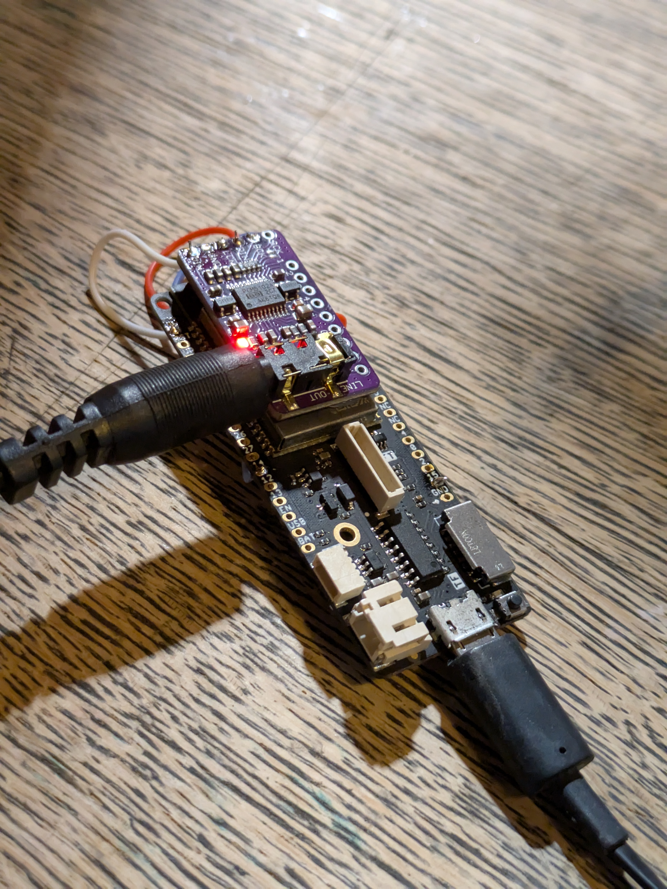

# ESP32 Bluetooth Receiver

 

This is the code for a simple ESP32 based Bluetooth Receiver I use in my kitchen. 

It outputs audio via i2s to an external DAC. I use a cheap PCM5102A board with this. 

Based on [this library](https://github.com/pschatzmann/ESP32-A2DP).
